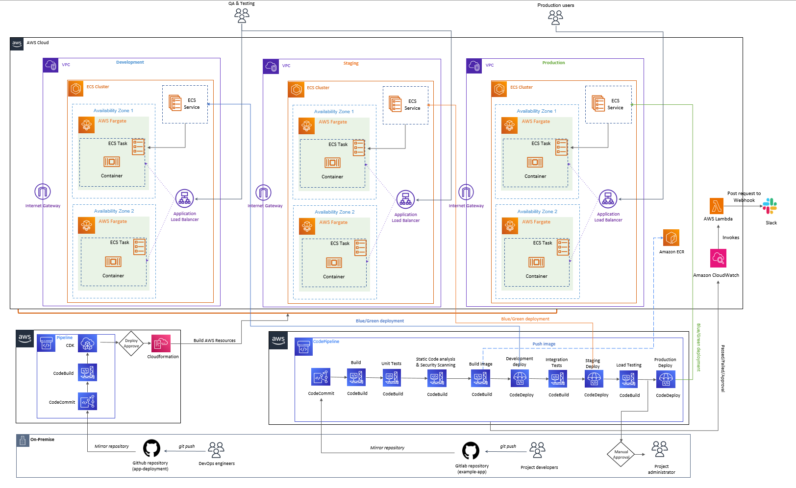
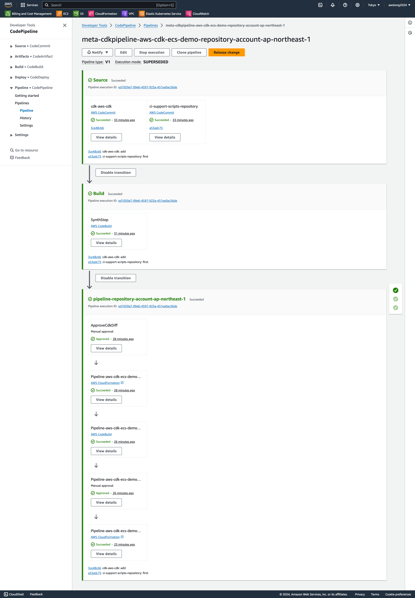
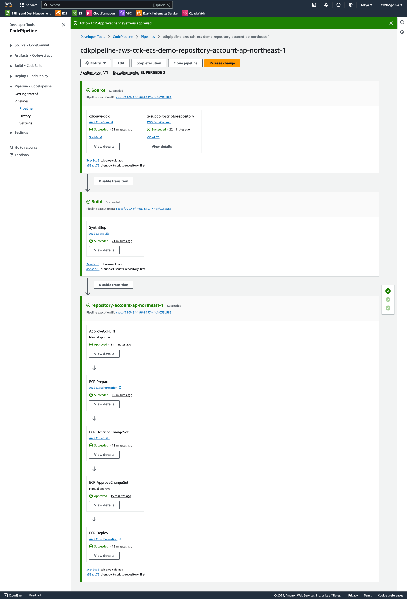
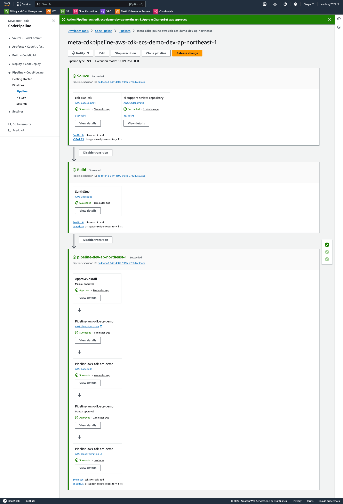
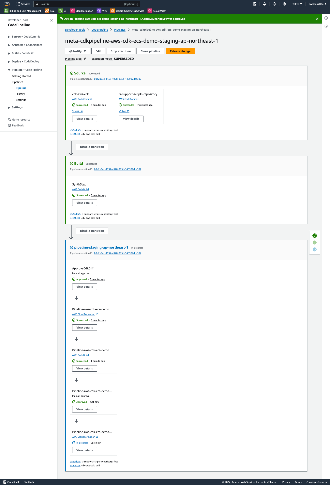
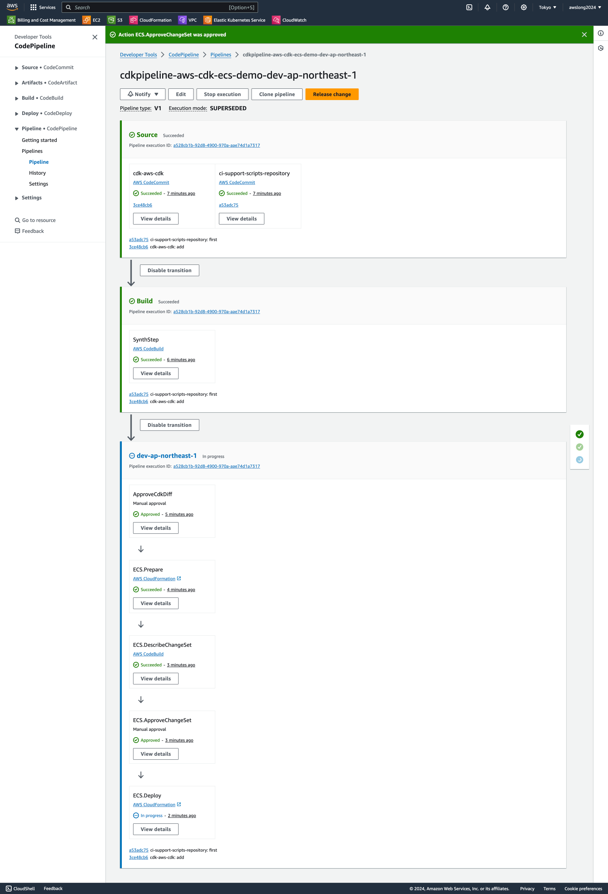
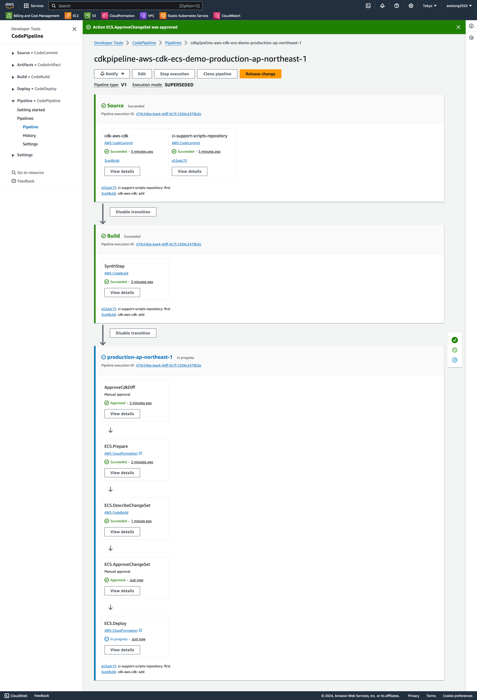

# Welcome to standard application deployment workflow project!



Define the CI/CD Pipeline:

    CI/CD Pipeline Stages:

     1. Source Code Checkout
     2. Build
     3. Unit Tests
     4. Static Code Analysis & Security Scanning
     5. Build and push docker image to ECR
     6. Deploy to Development
     7. Integration Tests
     8. Deploy to Staging
     9. Load Testing
     10.Approval for Production
     11.Deploy to Production
     12.Notify Slack

Step 1: Set Up Repositories

Có 3 repositories:
 1. Repository cho example app
    https://github.com/lehoai257/example-app.git
    branch: deploy/dev
 2. Repository cho Infrastructure as Code (IaC)
    https://github.com/lehoai257/app-deployment.git
    branch: deploy/dev
 3. Repository cho các tool support trong việc triển khai IaC
    https://github.com/lehoai257/ci-support-scripts-repository.git
    branch: deploy/support

Hãy thực hiện mirror cả 3 repositories lên AWS CodeCommit theo như link hướng dẫn bên dưới:
    https://medium.com/@aditya.kristianto/how-to-simple-mirroring-your-repository-to-aws-codecommit-1383ca680695


Step 2: Triển khai Infrastructure as Code (IaC)

    Việc triển khai IaC sẽ taọ ra các AWS codePipeline pipeline, mỗi môi trường sẽ tạo ra một pipeline nhằm mục đích kiểm soát việc triển khai AWS Resource 

    1. Trên repository app-deployment hãy hiện setup môi trường CDK như sau:

        This is a blank project for CDK development with Python.

        The `cdk.json` file tells the CDK Toolkit how to execute your app.

        This project is set up like a standard Python project.  The initialization
        process also creates a virtualenv within this project, stored under the `.venv`
        directory.  To create the virtualenv it assumes that there is a `python3`
        (or `python` for Windows) executable in your path with access to the `venv`
        package. If for any reason the automatic creation of the virtualenv fails,
        you can create the virtualenv manually.

        To manually create a virtualenv on MacOS and Linux:

        ```
        $ python -m venv .venv
        ```

        After the init process completes and the virtualenv is created, you can use the following
        step to activate your virtualenv.

        ```
        $ source .venv/bin/activate
        ```

        If you are a Windows platform, you would activate the virtualenv like this:

        ```
        % .venv\Scripts\activate.bat
        ```

        Once the virtualenv is activated, you can install the required dependencies.

        ```
        $ pip install -r requirements.txt
        ```

        At this point you can now synthesize the CloudFormation template for this code.

        ```
        $ cdk synth
        ```

        To add additional dependencies, for example other CDK libraries, just add
        them to your `setup.py` file and rerun the `pip install -r requirements.txt`
        command.

        ## Useful commands

        * `cdk ls`          list all stacks in the app
        * `cdk synth`       emits the synthesized CloudFormation template
        * `cdk deploy`      deploy this stack to your default AWS account/region
        * `cdk diff`        compare deployed stack with current state
        * `cdk docs`        open CDK documentation

    2. Thay đổi parameters ở file /data/parameters.yaml
        Đã có chú thích ở trong file (Vui lòng chỉ thay đổi ở nhưng chổ có comment)

    3. Chuẩn bị trước khi deploy AWS resource (infras cho example-app)
        Hãy chạy các câu lệnh sau:
        - cdk bootstrap (khởi tạo cdk trên môi trường AWS)
        - cdk synth (synthesize the CloudFormation template)
        - cdk ls (Liệt kê các stack cần deploy lên AWS)
        - cdk deploy {stack-name}
            Hãy triển khai lần lượt các stack sau:

    4. Deploy infras lên AWS 

        4.1 Deploy AWS ECR
            - Chạy lệnh: cdk deploy meta-pipeline-repository-account-{aws-region}/Pipeline //thay đổi {aws-region}
            - Sau khi chạy câu lệnh, AWS CDK sẽ tạo môt pipeline trên AWS codePipeline (pipeline này có nhiệm vụ tạo ra một pipeline khác cho mục đích deploy ECR repository)
            - Hãy truy cập vào AWS CodePipeline để theo dõi trạng thái của pipeline cũng như manual approval việc triển khai resource


            - Sau khi pipeline này chạy xong, nó sẽ tạo ra một pipeline khác có tên như sau:
                cdkpipeline-aws-cdk-ecs-demo-repository-account-{aws-region}
                -> pipeline này có nhiệm vụ triển khai ECR repository.
            - Hãy truy cập vào pipeline để theo dõi trạng thái của pipeline cũng như manual approval việc triển khai resource

            - Sau khi pipeline này chạy hoàn thành, chúng ta đã có ECR repository
            - Bước tiếp theo hãy thực hiện push một docker image lên ECR repository (source code ở repo example-app):

                + Dockerfile đã có sẵn trong sourcecode
                + chạy các câu lệnh sau:
                    aws --version
                    aws ecr get-login-password --region $REGION | docker login --username AWS --password-stdin $AWS_ACCOUNT_ID.dkr.ecr.$REGION.amazonaws.com
                    mvn package
                    docker build -f Dockerfile -t $IMAGE_REPO_NAME:$IMAGE_TAG .
                    docker tag $IMAGE_REPO_NAME:$IMAGE_TAG $AWS_ACCOUNT_ID.dkr.ecr.$REGION.amazonaws.com/$IMAGE_REPO_NAME:$IMAGE_TAG
                    docker push $AWS_ACCOUNT_ID.dkr.ecr.$REGION.amazonaws.com/$IMAGE_REPO_NAME:$IMAGE_TAG

        4.2 Deploy Infras cho môi trường Development, Staging, Production 
            - Chạy lệnh: cdk deploy meta-pipeline-dev-{aws-region}/Pipeline meta-pipeline-staging-{aws-region}/Pipeline meta-pipeline-production-{aws-region}/Pipeline //thay đổi {aws-region}
            - Sau khi chạy câu lệnh, AWS CDK sẽ tạo 3 pipeline (tương ứng từng môi trường) trên AWS codePipeline (pipeline này có nhiệm vụ tạo ra một pipeline khác cho mục đích deploy Infras cho từng môi trường)
            - Hãy truy cập vào AWS CodePipeline để theo dõi trạng thái của những pipeline cũng như manual approval việc triển khai resource

            pipeline development


            pipeline staging


            pipeline production


            - Sau khi 3 pipeline này chạy xong, nó sẽ tạo ra 3 pipeline khác có tên như sau:
                pipeline-dev-ap-northeast-1/Pipeline
                pipeline-staging-ap-northeast-1/Pipeline
                pipeline-production-ap-northeast-1/Pipeline
                -> 3 pipeline này có nhiệm vụ triển khai infras cho 3 môi trường.
            - Hãy truy cập vào 3 pipeline này để theo dõi trạng thái của pipeline cũng như manual approval việc triển khai resource

            pipeline development


            pipeline staging


            pipeline production


            - Sau khi 3 pipeline này chạy hoàn thành, chúng ta đã có Infras cho cả 3 môi trường

        4.3 Deploy Workflow CICD Pipeline            

            - Chạy lệnh: cdk deploy meta-pipeline-pipeline-account-{aws-region}/Pipeline //thay đổi {aws-region}
            - Sau khi chạy câu lệnh, AWS CDK sẽ tạo pipeline trên AWS codePipeline (pipeline này có nhiệm vụ tạo ra một pipeline khác cho mục đích deploy workflow CICD pipeline)
            - Hãy truy cập vào AWS CodePipeline để theo dõi trạng thái của pipeline cũng như manual approval việc triển khai resource
            - Sau khi pipeline này chạy xong, nó sẽ tạo ra pipeline khác có tên như sau:
                pipeline-pipeline-account-ap-northeast-1/Pipeline
            - Hãy truy cập vào pipeline để theo dõi trạng thái của pipeline cũng như manual approval việc triển khai resource
            - Sau khi Pipeline này chạy hoàn thành, chúng ta đã có một workflow CICD pipeline

            Ngay bây giờ có thể thực hiện thay đổi sourcecode trên example-app và git push để có thể triển khai app cho cả 3 môi trường.

            Hãy truy cập vào AWS Codepipeline và chọn pipeline WORKFLOW-PIPELINE để thực hiện theo dõi tiến trình build-test-deploy lên 3 môi trường.

DONE